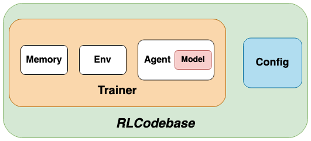

# RLCodebase
RLCodebase is a modularized codebase for deep reinforcement learning algorithms. This repo aims to provide an user-friendly reinforcement learning codebase for beginners to get started and for researchers to try their ideas quickly and efficiently. 

## Introduction
The design of RLCodebase is shown as below. 



* Config: Config is a class that contains parameters for reinforcement learning algorithms such as discount factor, learning rate, etc. and general configurations such as random seed, saving path, etc.
* Agent: Agent is a wrapped class that controls the workflow of reinforcement learning algorithms like a manager. It's responsible for the interactions among submodules (policy, environment, memory). 
* Policy: Policy tells us what action to taken given a state. It also implements a function that defines how to update the model given a batch of data.
* Environment: Environment is designed to be a vectorized gym environment. Here we use gym wrappers from OpenAI baselines for convenient implementations. 
* Memory: Memory stores data needed for improving our model.

## Installtion
All required packages have been included in setup.py and requirements.txt. To install RLCodebase, follow
````
# create virtual env
conda create -n rlcodebase python=3.6
conda activate rlcodebase

# install rlcodebase
git clone git@github.com:KarlXing/RLCodebase.git RLCodebase
cd RLCodebase
pip install -e .
pip install -r requirements.txt

# try it
python example_a2c.py
````

## Supported Algorithms
* DQN (PER)
* A2C
* PPO
* DDPG
* TD3
* SAC

## Results
### PPO & A2C In Atari Games


### DDPG & TD3 & SAC In Pybullet Environments


### DQN & DQN+PER In PongNoFrameskip-v4


## Citation
Please use the bibtex below if you want to cite this repository in your publications:
````
@misc{rlcodebase,
  author = {Jinwei Xing},
  title = {PyTorch Codebase For Deep Reinforcement Learning Algorithms},
  year = {2020},
  publisher = {GitHub},
  journal = {GitHub repository},
  howpublished = {\url{https://github.com/KarlXing/RLCodebase}},
}
````


## References for implementation and design
The design and some parts of implementation of this repo is referred from resources below.
* https://github.com/ikostrikov/pytorch-a2c-ppo-acktr-gail
* https://github.com/ShangtongZhang/DeepRL
* https://github.com/ray-project/ray/tree/master/rllib
